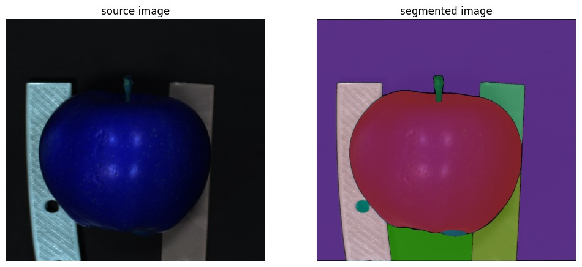
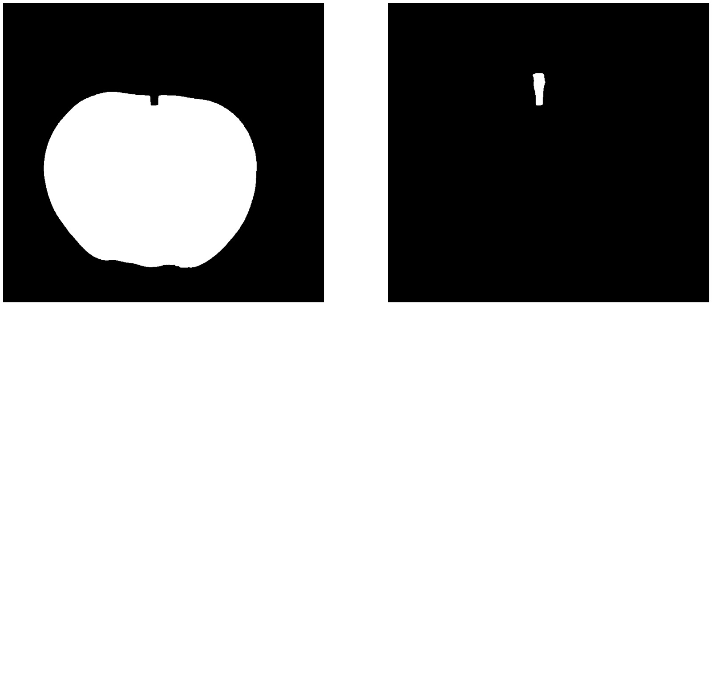
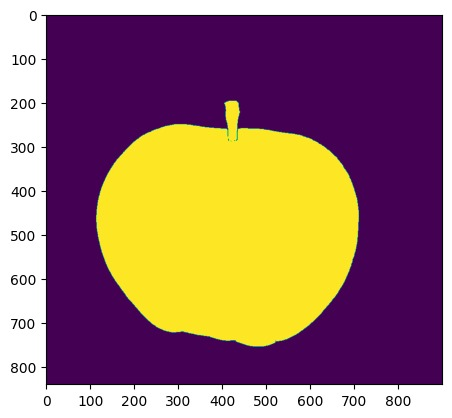
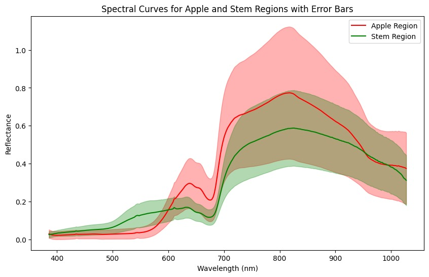
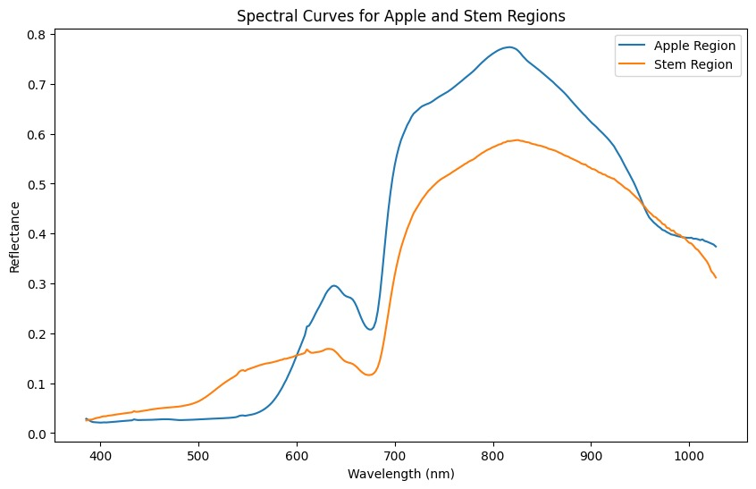

# 🍎 Apple & Stem Segmentation and Spectral Analysis

This project demonstrates segmentation of hyperspectral images using SAM (Segment Anything Model) and the extraction of spectral signatures from segmented apple and stem regions. It also includes visualization of masks and spectral reflectance data.

## 📁 Files Overview

| File | Description |
|------|-------------|
| `HSI_apple_SAM.ipynb` | Jupyter notebook for applying SAM-based segmentation on hyperspectral images and analyzing spectral curves. |
| `SAM_Confocal.ipynb` | Notebook demonstrating confocal image processing and mask extraction. |
| `Colored_Mask_aaple.jpg` | Colored segmentation mask for different image regions. |
| `Full_Mask_Apple.jpg` | Combined binary mask highlighting the apple and stem regions. |
| `Separate_masks.jpg` | Separate binary masks for apple (left) and stem (right) for better analysis. |
| `Spectral_apple_with_error_bars.jpg` | Spectral curves of apple and stem regions with standard deviation error bands. |
| `Spectral_bands_Apple.jpg` | Clean spectral reflectance curves for both regions across visible-NIR spectrum. |

## 🖼️ Visual Results

### Segmentation Results

<div align="center">
   
</div>

- Left: Colored segmentation with boundaries
- Right: Separate masks for apple and stem

### Binary Masks

<div align="center">
  
</div>

- Yellow = Apple + Stem region

### Spectral Curves

<div align="center">
   
</div>

- Error bands represent pixel-wise standard deviation in reflectance values.

## 📊 Methodology

1. **Segmentation with SAM**:
   - SAM is applied to isolate the apple and stem.
   - Masks are extracted and processed to binary form.

2. **Spectral Curve Extraction**:
   - Reflectance values across wavelength bands are averaged per region.
   - Standard deviation is calculated to show confidence intervals.

3. **Visualization**:
   - Spectral plots are generated for insight into material differences.

## ⚙️ Requirements

To run the notebooks, install:

```bash
pip install opencv-python numpy matplotlib scikit-image
```

If you're working with SAM:
```bash
pip install git+https://github.com/facebookresearch/segment-anything.git
```

## 📌 Applications

- Plant phenotyping
- Material classification
- Hyperspectral object detection
- Agricultural monitoring
